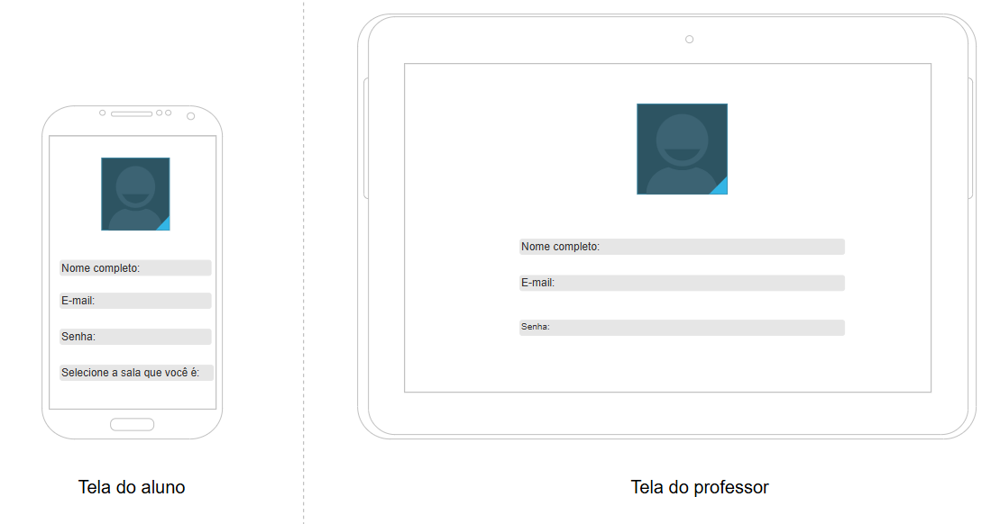
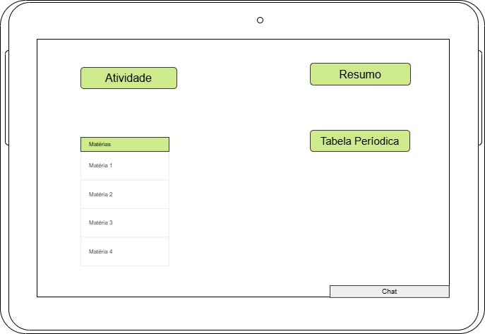

# SINTELE ⚗️
# 🧠 O que é e seu objetivo
SINTELE é um aplicativo/site de ensino desenvolvido por Gabriela, Luana, Liara e Larissa, com o objetivo de melhorar e otimizar o ensino da química na escola SESI, focando nos alunos do 2º e 3º ano do Ensino Médio. O aplicativo busca oferecer apoio ao professor dessa matéria(atualmente Luciano) por meio de resumos, jogos e quizzes informativos, videoaulas, interação digital com a tabela periódica, sistema de integração de Inteligência Artificial, entre outras formas. Assim, sobra mais tempo para aulas dinâmicas e experimentais, as quais a falta delas é uma das principais queixas dos alunos
# 🧩 Suas funcionalidades
  * 🔐 Sistema de login e cadastro
  * 📚 Metódos de ensino diversos (jogos educacionais, quizzes, resumos, I.A.)
  * 📲 Envio de mensagens com respostas da I.A.
  * 🥇 Sistema de competição com o objetivo de estimular os estudantes
  * 💬 Chat entre alunos e chat com professor
  * 📈 Visualizar suas maiores dificuldades
# 🔄 Fluxo do aplicativo
1. Usuário cria cadastro, assim podendo realizar login, posteriormente
2. Assim que os dados forem preenchidos, eles ficaram salvos no banco de dados
3. O usuário poderá:
	* Jogar jogos educativos
	* Visualizar e acrescentar resumos
	* Visualizar e acrescentar vídeos
	* Interagir digitalmente com a tabela periódica
	* Interagir com uma I.A. treinada
	* Interagir com outros alunos
	* Interagir com o professor de química
	* Criar salas de competição (quem acertar mais questões, finalizar mais jogos e quizzes sobe de posição)
	* Entrar em contato com o suporte se necessário
# 📄 Exemplo de um requisito funcional e não funcional do SINTELE
{RF001-O usuário deve cadastrar seu e-mail para fazer login
* RNF001-O sistema deve enviar um código de confirmação em até 20 segundos no e-mail inserido no cadastro
# 💻 Wireframes

  

    

# 👥 Membros
Gabriela: https://github.com/GabiLeh

Larissa: https://github.com/LarissaGuarizo

Liara: https://github.com/Liaratolloto

Luana: https://github.com/Lucky17-10001
